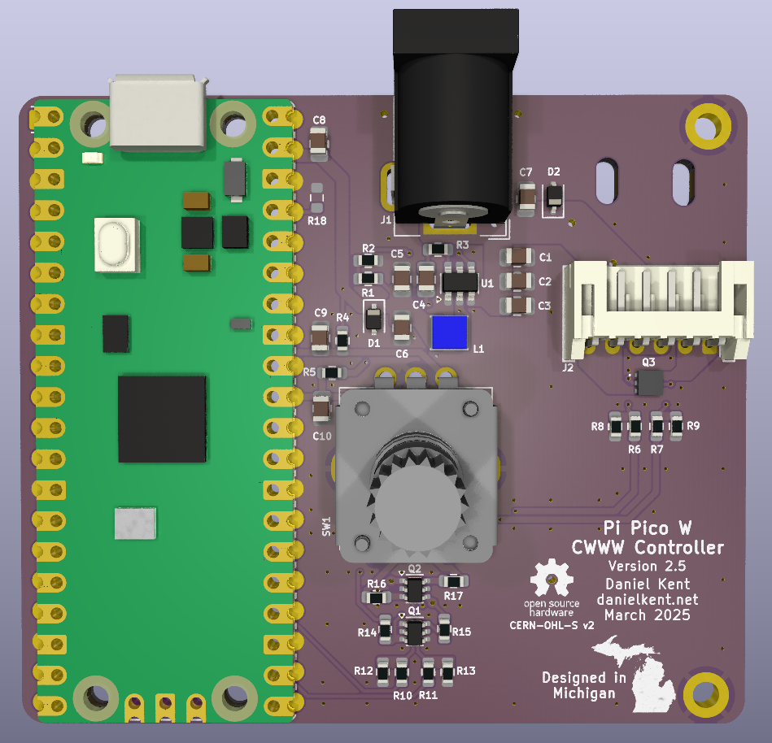
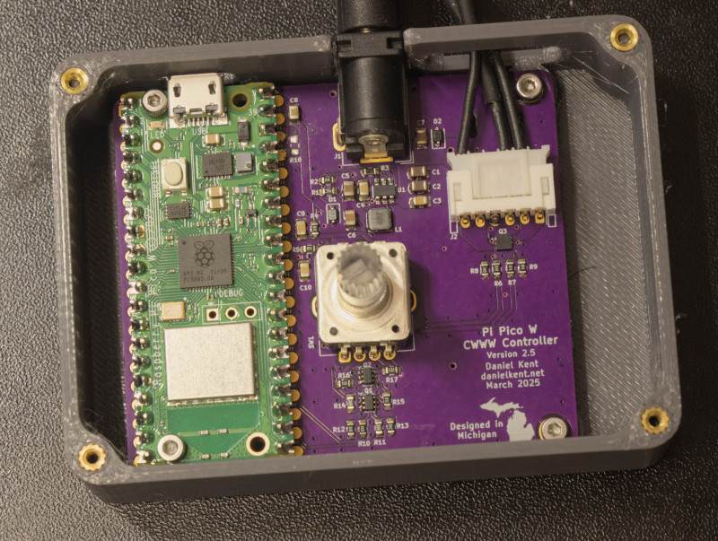

# cwww\_picohat: Pi Pico based Dual Cool/Warm LED Lamp Controller

A Raspberry Pi Pico/Pi Pico W based controller for dual cool white / warm
white common anode LED lamps.

|KiCAD Render | Assembled Version|
|---|---|
|  |  |

This repository contains two variants: the original "hat" based design, which
is smaller and contains a connector for a dedicated user I/O board, and a
larger "board" variant that puts everything on a flat board. The board
variant is a much more mature design and is recommended if you want to try
making this yourself.

This board was designed to work with
[ESPHome](https://github.com/esphome/esphome), but could be easily programmed
with other software tools.

# License

[The hardware is licensed under the CERN Open Hardware License Version
2 - Strongly Reciprocal](LICENSE).

[ESPHome configurations are licensed under the MIT license](LICENSE-SW).

